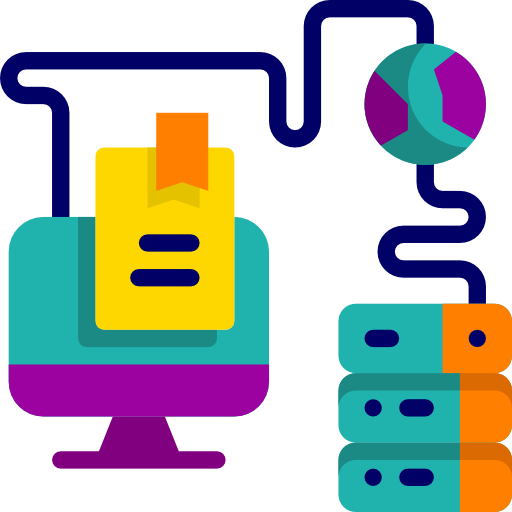

<!--
HOW TO USE:
This is an example of how you may give instructions on setting up your project locally.

Modify this file to match your project and remove sections that don't apply.

REQUIRED SECTIONS:
- Table of Contents
- About the Project
  - Built With
  - Live Demo
- Getting Started
- Authors
- Future Features
- Contributing
- Show your support
- Acknowledgements
- License

OPTIONAL SECTIONS:
- FAQ

After you're finished please remove all the comments and instructions!
-->

  <!-- You are encouraged to replace this logo with your own! Otherwise you can also remove it. -->
  
   

<!-- TABLE OF CONTENTS -->

# 📗 Table of Contents

- [📗 Table of Contents](#-table-of-contents)
- [📖 \[Ruby Capstone\] ](#-ruby-capstone-)
  - [🛠 Built With ](#-built-with-)
    - [Tech Stack ](#tech-stack-)
    - [Key Features ](#key-features-)
  - [Video Description ](#video-description-)
  - [💻 Getting Started ](#-getting-started-)
    - [Prerequisites](#prerequisites)
    - [Setup](#setup)
    - [Install](#install)
    - [Usage](#usage)
    - [Run tests](#run-tests)
  - [👥 Authors ](#-authors-)
  - [🔭 Future Features ](#-future-features-)
  - [🤝 Contributing ](#-contributing-)
  - [⭐️ Show your support ](#️-show-your-support-)
  - [🙏 Acknowledgments ](#-acknowledgments-)
  - [❓ FAQ (OPTIONAL) ](#-faq-optional-)
  - [📝 License ](#-license-)

<!-- PROJECT DESCRIPTION -->

# 📖 [Ruby Capstone] 

**[Ruby Capstone]** Is the the ultimate tool to organize and track all your possessions including books, music albums, movies, and games. The app stores data in a JSON file, ensuring easy accessibility and seamless use every time you launch the program..

## 🛠 Built With 

### Tech Stack 

- The app built using [Ruby](https://www.ruby-lang.org/en/).
- The **schema** file built using **SQL**.

<!-- Features -->

### Key Features 

The app help you to keep recods about any items you own, thing like

- **[Store and Display Games]**
- **[Store and Display Music Albums]**
- **[Store and Display Books]**
- **[Store and Display Movies]**

(<a href="#readme-top">back to top</a>)

## Video Description 

In this recorder video we are describing how we built this amazing project as a team.

(<a href="#readme-top">back to top</a>)

<!-- GETTING STARTED -->

## 💻 Getting Started 

To get a local copy up and running, follow these steps.

### Prerequisites

In order to run this project you need:

- Ruby should be installed in your local machine
- You need a Terminal.
- You need a code editor eg: `VsCode`

### Setup

Clone this repository to your desired folder:

  cd my-folder
  git clone https://github.com/MohamedCK/catalog-of-my-things

### Install

Install this project with:

Example command:

sh
  cd Ruby-Capstone
  bundle install

### Usage

To run the project, execute the following command:

Example command:

sh
  ruby main.rb

### Run tests

To run tests, run the following command:

Example command:

sh
  rspec spec

(<a href="#readme-top">back to top</a>)

<!-- AUTHORS -->

## 👥 Authors 

👤 **JAMES A Manu**

- GitHub: [@jaamanu](https://github.com/jaamanu)
- Twitter: [@jamesasibeymanu](https://twitter.com/jamesasibeymanu)
- LinkedIn: 

👤  **Suleiman Olaade**

- GitHub: [@Ceemos96](https://github.com/Ceemos96)
- Twitter: [@Ceemos_dev](https://twitter.com/Ceemos_dev)
- LinkedIn: [suleiman-olaide](https://www.linkedin.com/in/suleiman-olaide)

👤 **Mohamed Abdulhakim**
Software Developer | Javascript, React, Redux, MongoDB, PostgreSql, Ruby. | Good with Frontend. #OPENTOWORK
- GitHub: [@MohamedCK](https://github.com/MohamedCK)
- LinkedIn: [@mohamed-cake](https://www.linkedin.com/in/mohamed-cake/)

(<a href="#readme-top">back to top</a>)

<!-- FUTURE FEATURES -->

## 🔭 Future Features 

- [ ] **[Searching Functionality for a specific item]**
- [ ] **[Provide a simple way for the user to choose from a list of options]**

(<a href="#readme-top">back to top</a>)

<!-- CONTRIBUTING -->

## 🤝 Contributing 

Contributions, issues, and feature requests are welcome!

Feel free to check the [issues page](../../issues/).

(<a href="#readme-top">back to top</a>)

<!-- SUPPORT -->

## ⭐️ Show your support 

If you like this project...

(<a href="#readme-top">back to top</a>)

<!-- ACKNOWLEDGEMENTS -->

## 🙏 Acknowledgments 

I would like to thank Microverse

(<a href="#readme-top">back to top</a>)

<!-- FAQ (optional) -->

## ❓ FAQ (OPTIONAL) 

<!-- LICENSE -->

## 📝 License 

This project is [MIT](./LICENSE) licensed.

_NOTE: we recommend using the [MIT license](https://choosealicense.com/licenses/mit/) - you can set it up quickly by [using templates available on GitHub](https://docs.github.com/en/communities/setting-up-your-project-for-healthy-contributions/adding-a-license-to-a-repository). You can also use [any other license](https://choosealicense.com/licenses/) if you wish._

(<a href="#readme-top">back to top</a>)

